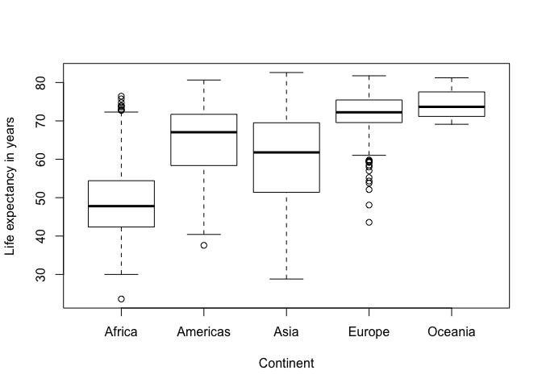

In this document we will test some basic functions of R that can be used to explore a dataset.

# Loading the data

Start by loading in the 'gapminder' dataset, which we will be exploring. If you don't already have this dataset downloaded, run 'install.packages("gapminder") in your R console.

```r
library(gapminder)
```
Now the gapminder dataset is loaded.

# Data exploration

Now we will start to explore the dataset, first let's look at the first few rows of data that the dataset contains using the 'head' function:

```r
head(gapminder)
```

```
## # A tibble: 6 x 6
##   country     continent  year lifeExp      pop gdpPercap
##   <fct>       <fct>     <int>   <dbl>    <int>     <dbl>
## 1 Afghanistan Asia       1952    28.8  8425333      779.
## 2 Afghanistan Asia       1957    30.3  9240934      821.
## 3 Afghanistan Asia       1962    32.0 10267083      853.
## 4 Afghanistan Asia       1967    34.0 11537966      836.
## 5 Afghanistan Asia       1972    36.1 13079460      740.
## 6 Afghanistan Asia       1977    38.4 14880372      786.
```
We can see here that there are columns for country, continent, year, life expectancy, population, and per capita GDP. The head function shows us the first six rows of data. 

We can also take a look at the structure of the dataset using the 'str' function:


```r
str(gapminder)
```

```
## Classes 'tbl_df', 'tbl' and 'data.frame':	1704 obs. of  6 variables:
##  $ country  : Factor w/ 142 levels "Afghanistan",..: 1 1 1 1 1 1 1 1 1 1 ...
##  $ continent: Factor w/ 5 levels "Africa","Americas",..: 3 3 3 3 3 3 3 3 3 3 ...
##  $ year     : int  1952 1957 1962 1967 1972 1977 1982 1987 1992 1997 ...
##  $ lifeExp  : num  28.8 30.3 32 34 36.1 ...
##  $ pop      : int  8425333 9240934 10267083 11537966 13079460 14880372 12881816 13867957 16317921 22227415 ...
##  $ gdpPercap: num  779 821 853 836 740 ...
```
1704 observations of 6 variables

- country is a factor with 142 levels
- continent is a factor with 5 levels
- year is an integer, beginning in 1952 with increments of 5 years
- lifeExp is the life expectancy for each country in years
- pop is the population of each country in a specific year
- gdpPercap is the per capita GDP in each country in a specific year

We can also just determine the number of columns in the dataset using the 'ncol' function:


```r
ncol(gapminder)
```

```
## [1] 6
```
The dataset has 6 columns.

# Descriptive statistics

We can look at the mean, median, maximum and minimum of a variable in the dataset using these functions:

```r
mean(gapminder$lifeExp)
```

```
## [1] 59.47444
```

```r
median(gapminder$lifeExp)
```

```
## [1] 60.7125
```

```r
min(gapminder$lifeExp)
```

```
## [1] 23.599
```

```r
max(gapminder$lifeExp)
```

```
## [1] 82.603
```
Life expectancy (years)
- Mean: 59.5
- Median: 60.7
- Minimum: 23.6
- Maximum: 82.6

We can also make graphs to compare variables in a dataset. Let's see how life expectancy varies by continent:

```r
plot(gapminder$continent, gapminder$lifeExp, xlab= "Continent", ylab= "Life expectancy in years")
```

<!-- -->

This boxplot shows that people in Africa have the lowest average life expectancy, while people in Oceania have the highest average life expectancy. 


